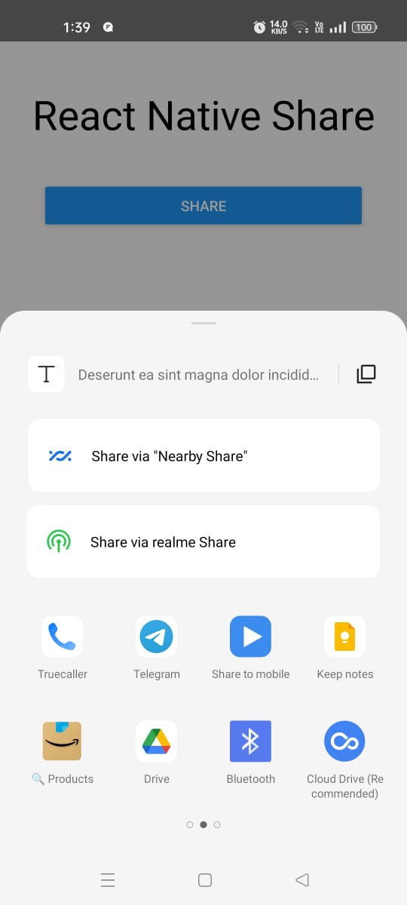
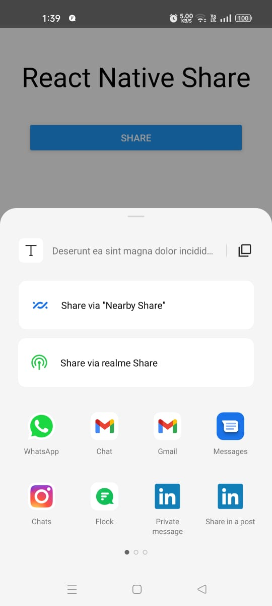

# React Native Social Share
React Native Social Share allows you to share any information through Social Meida. It supports all the social media platforms installed on the device ranging from Instagram, Facebook to Gmail and LinkedIn.
You can watch the complete tutorial on how to build add this Social Media Share feature to your application [here](https://youtu.be/TGTNBxbFHRY)

### What will we be building?

|  |  |
| :-------------: | :-------------: |
